# MechaCar_Statistical_Analysis

## Objectives
The objective of this project is to help Jeremy, an employee of AutosRUS, figure out the parameters of the MechaCars that would make it most competitive in the market. A successful launch of automibiles utilize data analytics in every decision making. We used R, RStudio for analysis that contained quantitative metric and a clear interpretation of the results that would help with the decisions. We helped Jeremy perform statistical tests using R programming language. We used R and R-Studio to do the summary statistics regression analysis, t-test, visualized the data using ggplot2 in R and made our interpretation of the statistical results. The analysis of different studies is shown in Deliverables 1, 2 and 3. A summary conclusion is given in Deliverable 4.

## 1. Linear Regression to Predit MPG
We are provided with a csv file, *MechaCar_mpg.csv* that contained data from 50 test results of prototype MechaCars. It contained multiple design specifications to identify an ideal vehicle performance. The metrics were, vehicle length, vehicle weight, spoiler angle, drivetrain (AWD) and ground clearance and mpg. We performed a multiple linear regression using _lm()_ function in R. We used _mpg_ as the dependent variable and *vehicle_length*, *vehicle_weight*, *spolier_angle* and *ground_clearance* as the independent variables. The result is shown in Fig 1. Note that the slope coefficients are of different units. It is important to take that into account during an analysis. For further analysis, I took the difference between the maximum and minimum values of each independent variables and multiplied it with the corresponding slope coefficient from the multiple regression analysis. I named the resulting data _mpg factor_. (Fig 2). Using the equation, mpg = slope-coeff*range gives an idea which component will affect the mpg the most. The data shows that the spoiler angle and AWD will affect the performance of the cars least. The vehicle length and ground clearance affects the mpg performance the most. 

The _summary()_ function was used to determine the p-value and the r-squared value for the linear regression model. The result is shown in the image in Fig 3. These results further support the analysis above by matching with the rank ordering of the p-values as shown in Fig. 3. The length of car has the lowest p-value of 2.6E-12 and the ground clearance has a p-value of 5.2E-08. Both of these variables are statistically significant. The next lowest p-value is for weight of the car which is about 0.08, which is often considered not statistically significant. The R-square value obtained was 0.71 which means this is a good statistical model. 

Next, a collective variable was made in R by taking Xc = m1*x1 + m2*x2 + ... m5*x5, where each of the five variables are included. By doing this, the mpg can be plotted against the collective variable, to get a scatter plot, and the predicted line will have a slope of 1.  This allows a visual check to verify that the multivariate fit is valid as shown in Fig 4. The resulting scatter plot with a regression line layered is shown in Fig 4.

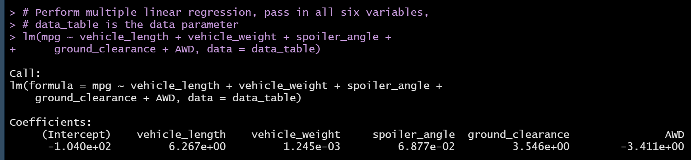

**Fig 1.** The image shows the results of the multiple linear regression performed on MechaCar vehicle data. 

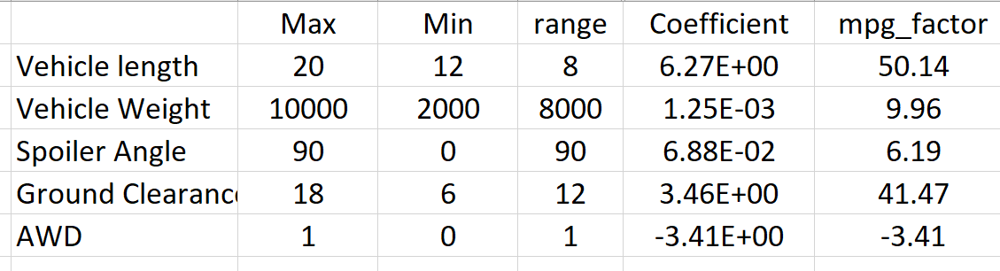

**Fig 2.** The image shows the dependence of mpg to different MechaCar components.

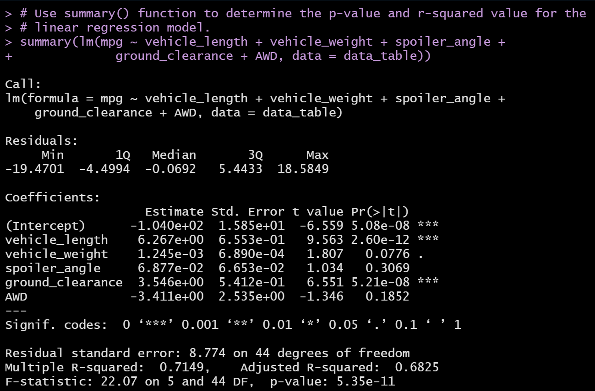

**Fig 3.** The image shows the results of the p-value and the r-squared value of independent variables in MechaCar vehicle data.

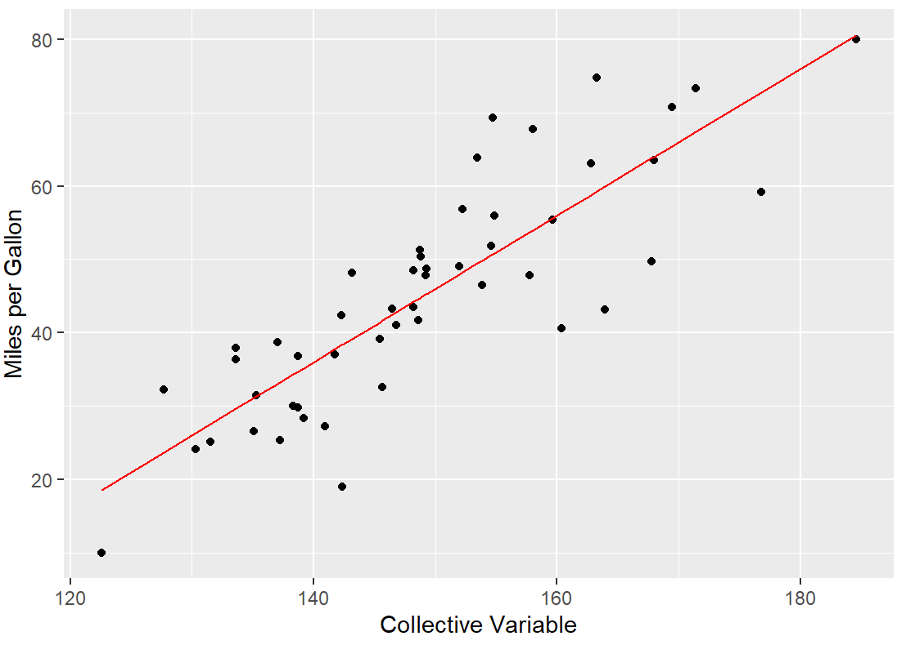

**Fig 4.** The image shows the fuel efficiency of MechaCars as a function of collective variables. The scatter plot is from multiple regression analysis.

## 2. Summary Statistics on Suspension Coil

We are given another set of data in *Suspension_Coil.csv* file that contained results from three production lots. The weight capacities (measured in PSI) of the suspension coils were tested to determine if the manufacturing process is consistent across the manufacturing lots. I wrote an RScript to create a dataframe and then used _summarize()_ function to obtain mean, median, variance and standard deviation of the PSIs. I performed this calculation for all the suspension coils across all the lots (Fig 5). The mean and median are close, about 1500 PSI.

We also investigated the mean, median, variance and standard deviation of suspension coil manufactured by each lot. The result is shown in Fig 6. The standard deviation of PSI testing values for the Manufacturing Lot 3 is larger than that of the other two lots. I made a boxplot of the PSI with a scatter plot overlay for each manufacturing lot (Fig 7). The data for lots 1 and 2 are within the design specification. MechaCar design specification dictates that the standard deviation of the PSI should be less than 10 PSI (Variance = 100). Lot 3 has a standard deviation of 13.04. The test result of the PSI of Lot 3 suggests that something must be wrong with the manufacturing process. The data suggests that the materials and manufacturing  process needs to be investigated to prevent further inferior products.

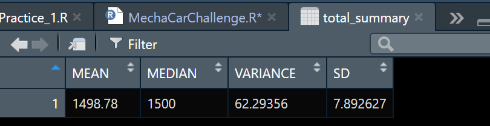

**Fig 5.** The summary table showing mean, media, variance and standard deviation across all the manufacturing lots.

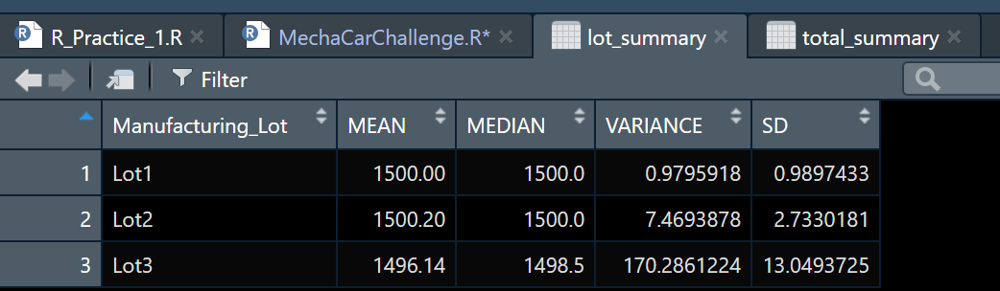

**Fig 6.** The summary table of the mean, median, variance and standard deviation of the PSI values manfactured at each lot.

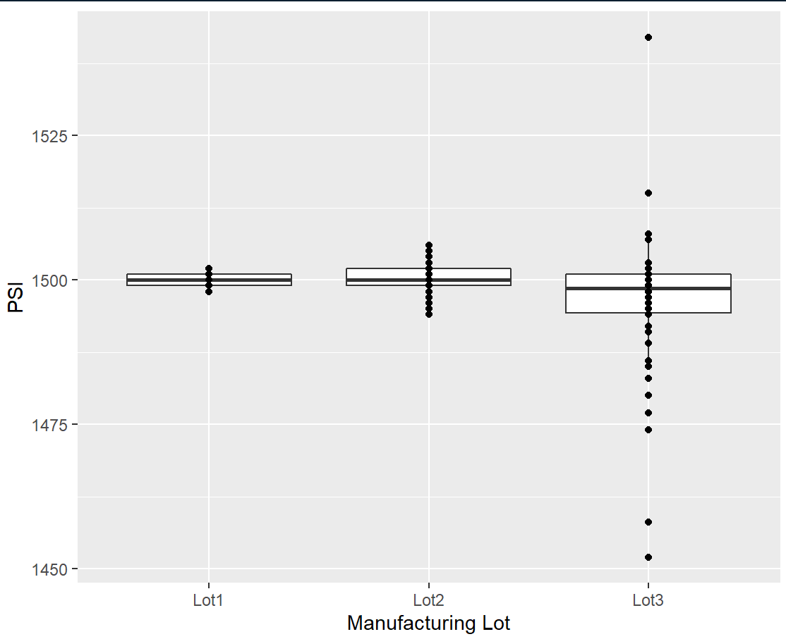

**Fig 7.** A box plot with a scatter plot overlay showing test results of the PSI data of the suspension coils made at the three manufacturing lots.

## 3. T-Tests on Suspension Coils

The population mean for the suspension coils weight bearing tests is 1500 PSI. We performed a _t.test()_ to determine whether the PSI for each manufacturing lot is statistically different from the population mean. Fig 8 shows the population mean of all the three manufacturing plants combined. A p-value, probability that we would find a PSI of 1500 (for our case), is calculated for each all the three lots combined, as well as for individual lot. The results are shown in Figs 9, 10 and 11. For this analysis to be correct the distribution for the population of the suspension coils must be distributed as a Gaussian distribution. The justification for making this assumption is that the box plots indicate the data for all three lots are distributed normally. A large p-value > 0.05 implies that there is no statistical difference between the sample values and the population mean value (the null hypothesis is correct). A smaller p-value < 0.05 implies that there is a statistical difference between the sample values and the population mean value (alternative hypothesis is correct). The t-test result showing p-value=0.042 confirms our observation from the box-plot (Fig 7) that Lot 3 manufacturing of the suspension coils is not consistent. 

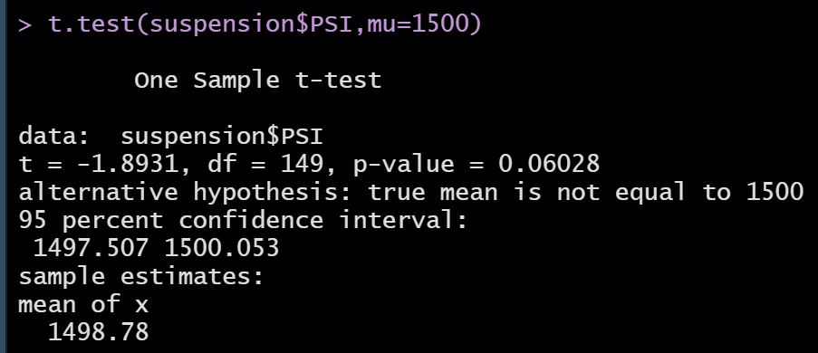

**Fig 8.** The image shows the t.test result of the sample taken from all the three manufacturing lots. The result is barely statistically significant.

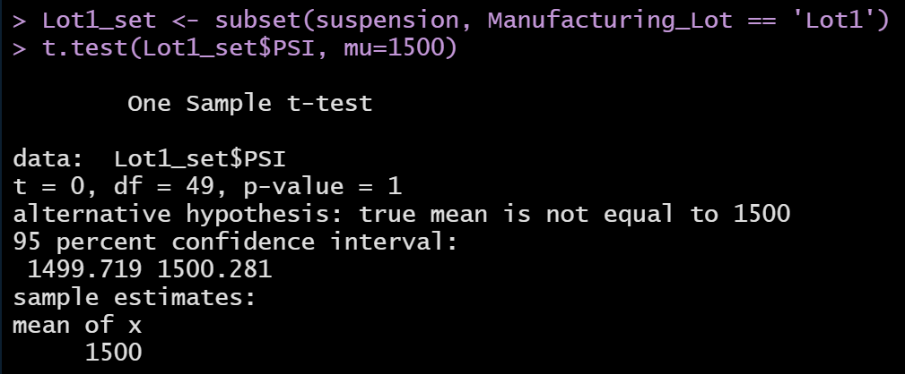

**Fig 9.** The image shows t-test results of Manufacturing Lot 1. A high p-value implies that there is no statistical difference between the population mean of 1500 PSI and the samples manufactured at this lot.

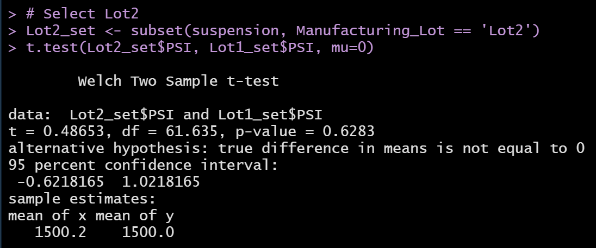

**Fig 10.** The image shows t-test results of Manufacturing Lot 2. A high p-value implies that there is no statistical difference between the population mean of 1500 PSI and the samples manufactured at this lot. 

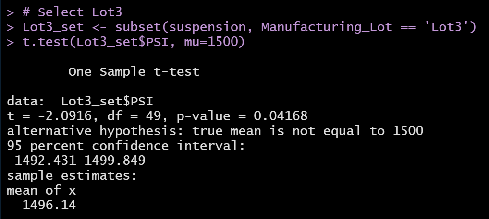

**Fig 11.** The image shows t-test results of Manufacturing Lot 3. A p-value smaller than 0.05 implies that there is a statistical difference between the population mean of 1500 PSI and the samples manufactured at this lot. 

## 4. Study Design: MechaCar vs Competition

MechaCar is the newest prototype vehicle of AutosRUs. Our study based on the test results of the data provided by the company suggests that there are some problems with the manufacturing of the suspension coils of one manufacturing lot. I compared the fuel efficiency of MechaCar with the highway fuel efficiency of other manufacturers (OM). The city fuel efficiency of these other cars is worse. I got the data of the other manufacturers from a built in data _mpg_ available in the R package. This data consisted of cars tested between the 1999 and 2008 model years. I performed a t-test to compare the mpg of the OM cars with the mpg of MechaCar. The result is shown in Fig 12. A very small p-value suggests that there is a significant statistical difference between the fuel efficiency of the MechaCars and the OM cars. The average mpg are 45.1 and 23.4 of the MechaCars and OM cars respectively. I also made two boxplots to the mpg data of MechaCar with the competition. The data sows that MechaCar is the clear winner in the mpg competition. However, we need more information to make a proper comparison. There is no information about the cost of the cars. 

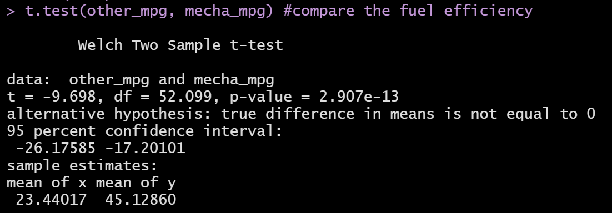

**Fig 12.** ttest results of MechaCar and other manufacturers car's fuel efficiency.

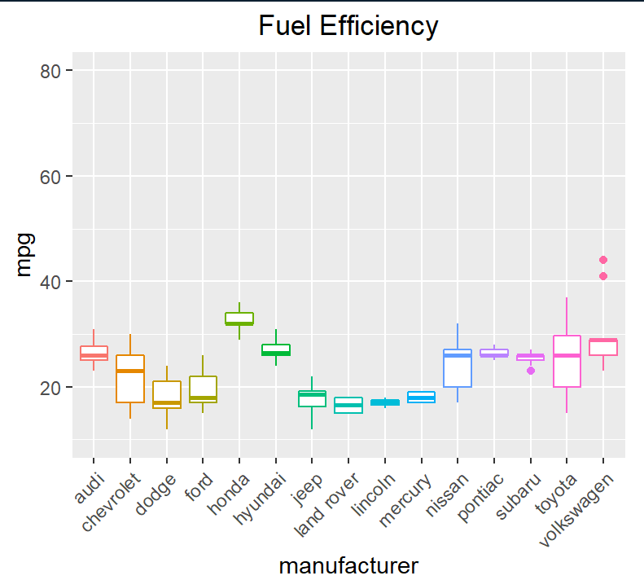

**Fig 13.** Fuel efficiency of other manufacturer's cars shown in a boxplot.

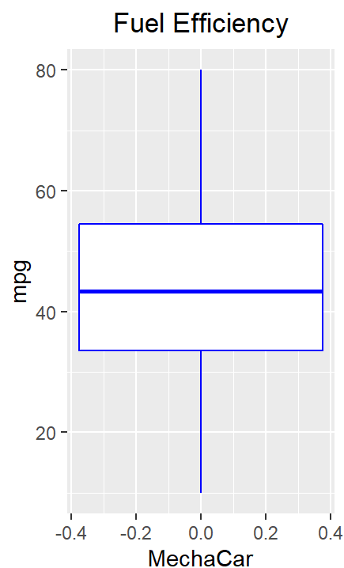

**Fig 14.** Fuel efficiency of MechaCar shown in a box plot. 

